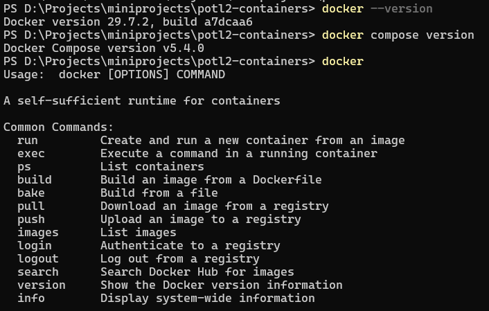
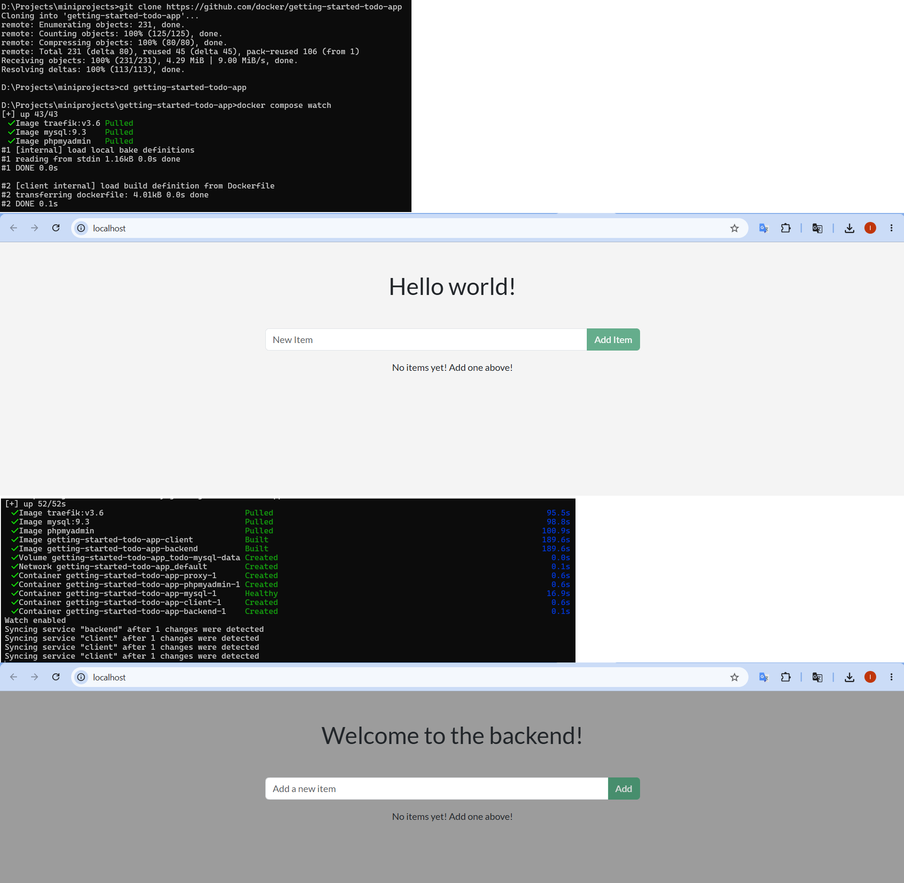
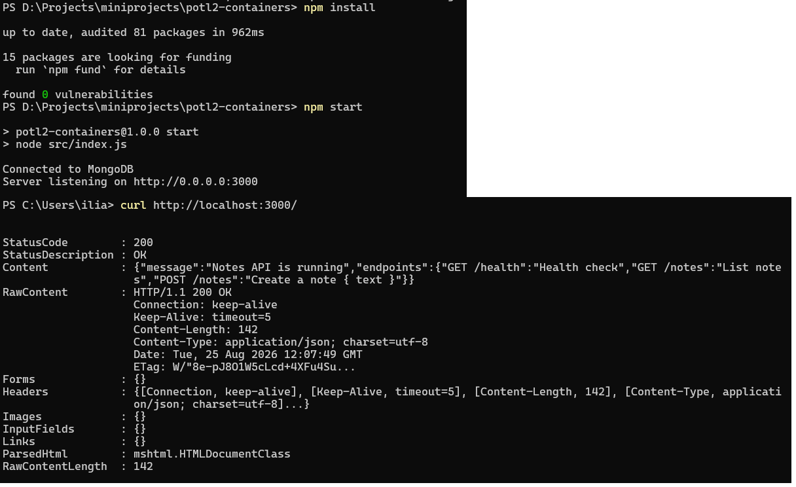
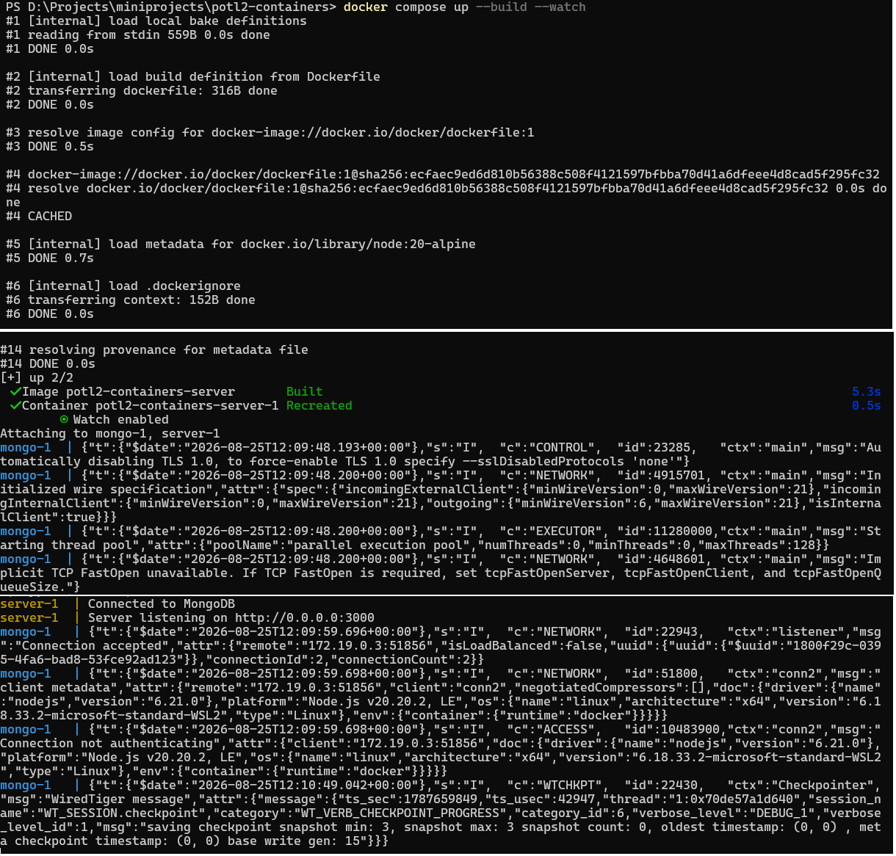
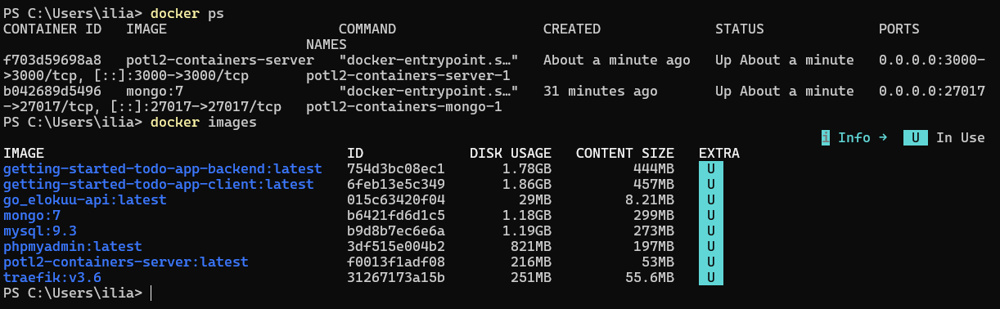
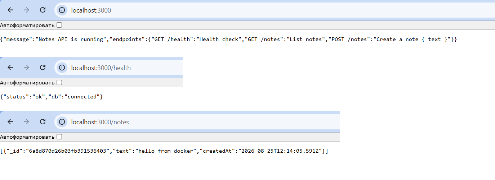

# potl2-containers

Lab documentation for Docker: Getting Started tutorial and a custom Node.js (Express) + MongoDB image.

## Part 1: Docker tutorial

Docker Desktop is installed. The official Getting Started tutorial was completed.

Commands checked:

```bash
docker
docker --version
docker compose version
```

Commands used in the tutorial:

```bash
git clone https://github.com/docker/getting-started-todo-app
cd getting-started-todo-app
docker compose watch
```





---

## Part 2: Own image from scratch

### Solution overview

A simple notes REST API built with **Express**. Data is stored in **MongoDB**. The app listens on `0.0.0.0:3000` so it is reachable from outside the container.

| Endpoint | Description |
|----------|-------------|
| `GET /` | API info |
| `GET /health` | MongoDB connectivity check |
| `GET /notes` | list notes |
| `POST /notes` | create a note `{ "text": "..." }` |

Project structure:

```
- compose.yaml
- Dockerfile
- package.json
- README.Docker.md
- README.md
- screenshots/
- src/
- - index.js
```

### Setup process

1. Created an Express app (`src/index.js`, `package.json`).
2. Local check (when Node.js and MongoDB are available):

```bash
npm install
npm start
```



3. Prepared the Docker stack similar to `docker init`:
   - `Dockerfile` — Node 20 Alpine, `npm install`, `CMD ["npm", "start"]`
   - `compose.yaml` — `server` and `mongo` services
   - `README.Docker.md` — short Docker documentation
4. Changed the app host to `0.0.0.0`.
5. Added a `develop.watch` block to `compose.yaml`:
   - changes in `./src` → `sync+restart`
   - changes in `package.json` → `rebuild`
6. Added a MongoDB service (`mongo:7`) and the `mongo-data` volume.

### Build and run

```bash
docker compose up --build --watch
```



```bash
docker ps
docker images
```



### API check

The app is available at http://localhost:3000

```bash
curl http://localhost:3000/
curl http://localhost:3000/health
curl http://localhost:3000/notes
```



### Commands used (summary)

| Command | Purpose |
|---------|---------|
| `docker --version` | Docker version |
| `docker compose version` | Compose version |
| `docker compose up --build --watch` | build, run, and watch |
| `docker compose down` | stop and remove containers |
| `docker ps` | list running containers |
| `docker images` | list images |
| `curl ...` | HTTP API check |
